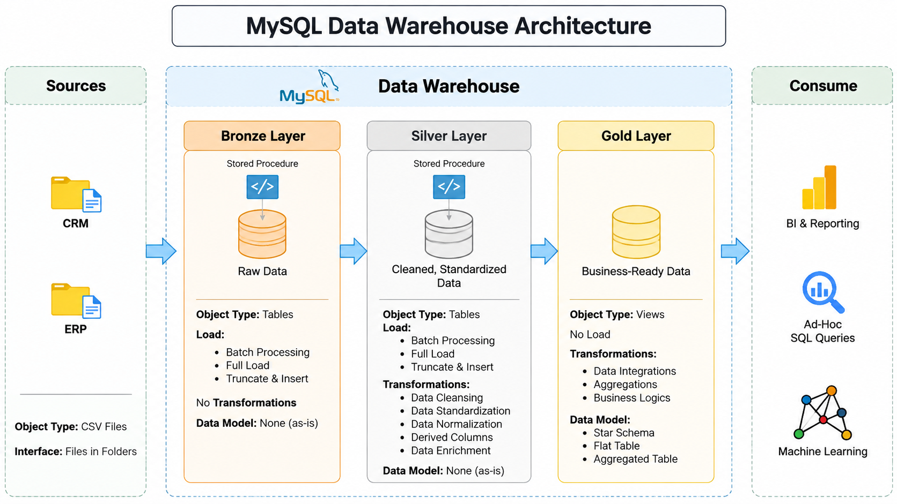
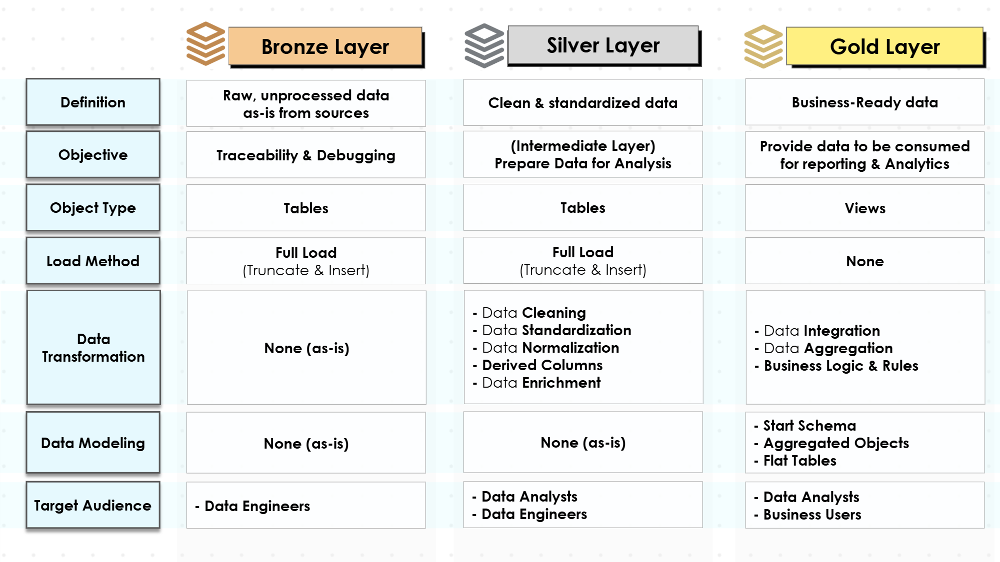
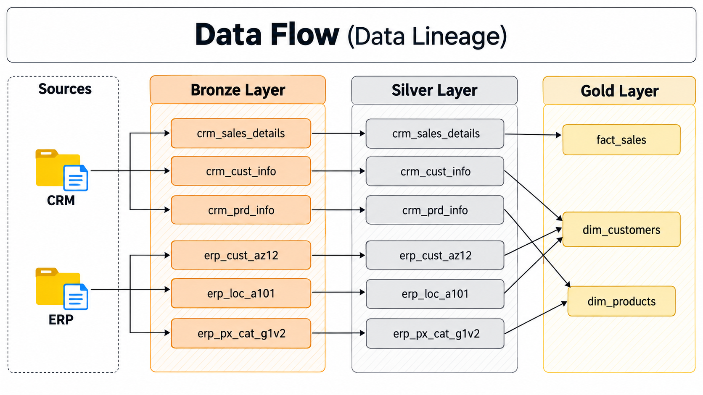
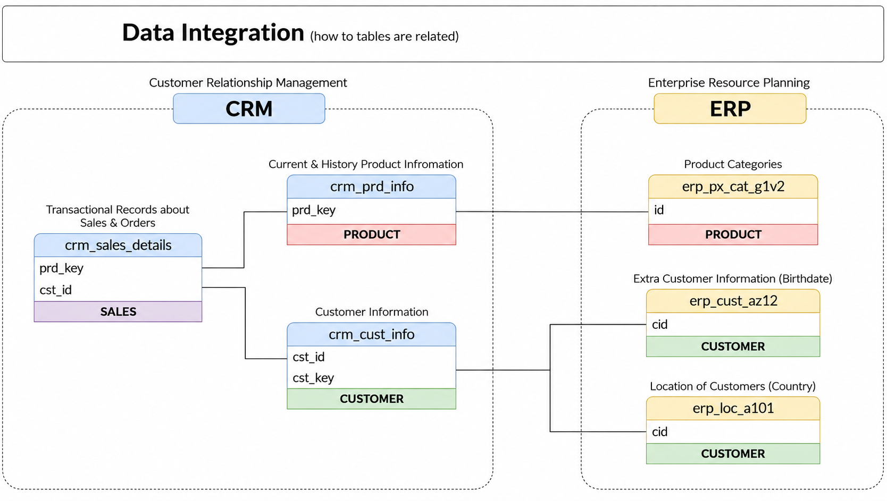
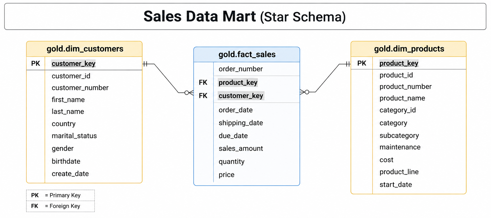

#  MySQL Data Warehouse 🏭

A complete end-to-end **MySQL Data Warehouse** built using the Medallion Architecture — Bronze, Silver, and Gold — with CRM and ERP source data integrated into a business-ready Sales Star Schema.

This project demonstrates practical data engineering workflows including data ingestion, data cleansing, standardization, transformation, source-system integration, data quality validation, dimensional modeling, and analytical data preparation.

> **Project Inspiration:** This project is independently implemented in MySQL and is inspired by the methodology and source datasets used in the [Data With Baraa SQL Data Warehouse Project](https://github.com/DataWithBaraa/sql-data-warehouse-project).
>
> The architecture concepts and learning methodology were used as references, while the SQL implementation, MySQL-specific adaptations, validation procedures, documentation, and project structure were developed specifically for this project.

---

## 🏗️ Architecture

The data warehouse follows the **Medallion Architecture**:

**Bronze → Silver → Gold**



### Bronze Layer

The Bronze layer stores data from the CRM and ERP source systems in its raw form.

- Source: CSV files
- Object type: Tables
- Loading strategy: Full Load
- Load method: `TRUNCATE + INSERT / LOAD DATA`
- Transformations: None
- Purpose: Preserve raw source data for traceability and debugging

### Silver Layer

The Silver layer contains cleaned, standardized, and integrated data prepared for analytical modeling.

Key transformations include:

- Data cleansing
- Data standardization
- Data normalization
- Derived columns
- Date conversion
- Identifier standardization
- Data enrichment
- Source-system integration
- Business-rule handling

### Gold Layer

The Gold layer provides business-ready analytical views modeled as a **Star Schema**.

The Gold layer contains:

- `gold.dim_customers`
- `gold.dim_products`
- `gold.fact_sales`

These objects are designed for analytical queries, reporting, and downstream BI use cases.

---

## 📊 Data Warehouse Layers

The following diagram summarizes the purpose and characteristics of each layer:



| Layer | Purpose | Object Type | Loading |
|---|---|---|---|
| Bronze | Raw source data | Tables | Full Load |
| Silver | Cleaned and standardized data | Tables | Full Load |
| Gold | Business-ready analytical data | Views | No Load |

---

## 🔄 Data Flow & Lineage

The source data originates from two systems:

- **CRM — Customer Relationship Management**
- **ERP — Enterprise Resource Planning**

The data flows through the warehouse as:

```text
CRM / ERP CSV Files
        ↓
     Bronze
        ↓
     Silver
        ↓
      Gold
        ↓
Analytics / Reporting
````



### Source Systems

#### CRM

* `cust_info.csv`
* `prd_info.csv`
* `sales_details.csv`

#### ERP

* `CUST_AZ12.csv`
* `LOC_A101.csv`
* `PX_CAT_G1V2.csv`

---

## 🔗 Data Integration

The CRM and ERP datasets contain complementary information and use different identifier formats.

The Silver layer standardizes and integrates these sources before they are used by the Gold layer.



### Customer Integration

Customer information is integrated using:

```text
CRM Customer Information
        ↓
ERP Customer Demographics
        ↓
ERP Customer Location
```

Source identifier formats are standardized during Silver transformation.

Examples include:

```text
CRM:
AW00011000

ERP Demographics:
NASAW00011000

ERP Location:
AW-00011000
```

### Product Integration

Product information is integrated with ERP product categories.

The product category identifier is derived from the CRM product key and used to connect product information with the ERP category dataset.

---

## ⭐ Gold Data Model

The Gold layer follows a **Sales Star Schema**.



### Dimension Tables

#### `gold.dim_customers`

Contains customer information enriched with:

* Demographic information
* Geographic information
* Customer attributes

#### `gold.dim_products`

Contains current product information enriched with:

* Category
* Subcategory
* Maintenance information
* Product line
* Cost

Historical product versions are filtered from the Gold product dimension.

#### `gold.fact_sales`

Contains sales transaction-line data including:

* Order
* Product
* Customer
* Order dates
* Shipping dates
* Quantity
* Price
* Sales amount

### Star Schema Relationships

```text
gold.dim_customers
        │
        │ customer_key
        ▼
gold.fact_sales
        ▲
        │ product_key
        │
gold.dim_products
```

The fact table connects to the dimensions through surrogate keys.

---

## 🧹 Data Quality & Validation

Data quality checks were performed at the Bronze, Silver, and Gold stages.

### Bronze Validation

Validation included:

* Row-count verification
* Source loading verification
* Raw-data preservation
* Load warning checks

### Silver Validation

Validation included:

* Null-value checks
* Duplicate detection
* Standardization checks
* Date validation
* Product validation
* Customer validation
* ERP integration validation
* Sales consistency validation

A key sales validation rule is:

```text
sales_amount = quantity × price
```

The final Silver validation returned:

```text
Empty set
```

for inconsistent sales records.

### Gold Validation

The Gold layer was validated for:

* Customer surrogate-key uniqueness
* Product surrogate-key uniqueness
* Fact-to-customer connectivity
* Fact-to-product connectivity

All Gold quality checks returned:

```text
Empty set
```

---

## 📈 Final Gold Layer

The completed Gold layer contains:

| Gold Object          | Records |
| -------------------- | ------: |
| `gold.dim_customers` |  18,485 |
| `gold.dim_products`  |     295 |
| `gold.fact_sales`    |  60,398 |

The Gold product dimension contains 295 current product records after historical product versions are filtered.

---

## 🛠️ Technology Stack

### Database

* MySQL
* MySQL Workbench

### Data Engineering

* SQL
* ETL / ELT concepts
* Medallion Architecture
* Data cleansing
* Data transformation
* Data integration
* Dimensional modeling
* Star Schema
* Data quality validation

### Documentation & Modeling

* draw.io
* Markdown
* Git
* GitHub

### Source Data

* CSV files
* CRM data
* ERP data

---

## 📁 Repository Structure

```text
mysql-data-warehouse/
│
├── datasets/
│   ├── source_crm/
│   │   ├── cust_info.csv
│   │   ├── prd_info.csv
│   │   └── sales_details.csv
│   │
│   └── source_erp/
│       ├── CUST_AZ12.csv
│       ├── LOC_A101.csv
│       └── PX_CAT_G1V2.csv
│
├── docs/
│   ├── DataFlow_Lineage_Diagram.png
│   ├── Data_Catalog.md
│   ├── Data_Integration.png
│   ├── Data_Layers.png
│   ├── Data_Model.png
│   ├── MySQL_DataWarehouse_Architecture.png
│   └── Naming_Conventions.md
│
├── scripts/
│   ├── bronze/
│   │   ├── ddl_bronze.sql
│   │   └── load_bronze.sql
│   │
│   ├── silver/
│   │   ├── ddl_silver.sql
│   │   └── load_silver.sql
│   │
│   ├── gold/
│   │   └── ddl_gold.sql
│   │
│   └── init_database.sql
│
├── tests/
│   ├── quality_checks_gold.sql
│   └── quality_checks_silver.sql
│
├── LICENSE
└── README.md
```
---

## 🔧 MySQL-Specific Implementation

The reference architecture was originally implemented using SQL Server.

This project adapts the architecture to MySQL.

### Database Organization

Instead of SQL Server schemas:

```text
DataWarehouse
├── bronze
├── silver
└── gold
```

this project uses separate MySQL databases:

```text
MySQL Server
│
├── bronze
├── silver
└── gold
```

For example:

```text
bronze.crm_cust_info
silver.crm_cust_info
gold.dim_customers
```

### Bronze Raw-Date Handling

The CRM customer creation date is stored as `VARCHAR(50)` in Bronze to preserve the original source representation, including problematic values such as:

```text
0000-00-00
```

The value is converted and cleaned in the Silver layer where it is stored as a proper `DATE`.

This is an intentional MySQL-specific adaptation that preserves the raw-data principle of the Bronze layer.

### Loading Implementation

The Bronze and Silver layers use standalone SQL scripts for loading rather than stored procedures.

This implementation decision was made to work with MySQL's loading behavior and the SQL execution environment used during development.

---

## 📚 Documentation

Additional project documentation is available in the `docs/` directory.

| Document                | Description                                         |
| ----------------------- | --------------------------------------------------- |
| `requirements.md`       | Project requirements and scope                      |
| `project_notes.md`      | Architecture, methodology, and implementation notes |
| `data_catalog.md`       | Gold-layer data catalog                             |
| `naming_conventions.md` | Naming standards used throughout the warehouse      |
| `data_architecture.png` | Overall warehouse architecture                      |
| `data_flow.png`         | End-to-end data lineage                             |
| `data_integration.png`  | Source-system integration                           |
| `data_model.png`        | Gold Star Schema                                    |
| `etl.drawio`            | ETL concepts and methods                            |

---

## 🚀 Project Workflow

The project was developed layer by layer using the following workflow:

```text
Analyze
   ↓
Design
   ↓
Code
   ↓
Validate
   ↓
Document
   ↓
Version Control
```

This process was applied across the Bronze, Silver, and Gold layers.

---

## 🎯 Project Scope

The project focuses on building the data warehouse foundation and preparing a reliable analytical data model.

The scope includes:

* Source-data analysis
* Data warehouse architecture
* Bronze ingestion
* Silver transformation
* CRM and ERP integration
* Gold dimensional modeling
* Data quality validation
* Documentation
* Version control

The resulting Gold layer provides the foundation for future analytical work such as:

* Customer analysis
* Product performance analysis
* Sales analysis
* KPI development
* BI dashboards
* Advanced analytics

---

## 📌 Project Status

| Phase                          | Status                     |
| ------------------------------ | -------------------------- |
| Foundation                     | ✅ Complete                 |
| Architecture & Source Analysis | ✅ Complete                 |
| Bronze Layer                   | ✅ Complete                 |
| Silver Layer                   | ✅ Complete                 |
| Gold Layer                     | ✅ Complete                 |
| Data Quality                   | ✅ Core validation complete |
| Analytics                      | 🔜 Planned                 |
| Power BI                       | 🔜 Planned                 |
| Final Portfolio Release        | 🔜 Planned                 |

---

## 🙏 Inspiration & Attribution

This project was independently implemented in MySQL while using the **Data With Baraa SQL Data Warehouse Project** as a learning and architectural reference.

Reference project:

[Data With Baraa — SQL Data Warehouse Project](https://github.com/DataWithBaraa/sql-data-warehouse-project)

The purpose of this repository is to demonstrate my own implementation of data warehousing concepts using MySQL, including the adaptations required for the MySQL environment.

---

## 📄 License

This project is licensed under the [MIT License](LICENSE).

The MIT License permits the use, modification, and distribution of this project, subject to the terms of the license.

---

## About Me


I'm **Victor Devanand Kongala**, an Electronics and Communication Engineering undergraduate at **SRM Institute of Science and Technology**, graduating in 2027.

I'm interested in **Data Analytics, Data Engineering, AI/ML, and building software systems**. I enjoy working across the data lifecycle — from understanding raw data and designing data pipelines to building analytical models and extracting meaningful insights.

### Areas of Interest

- Data Analytics & Business Intelligence
- Data Engineering & Data Warehousing
- SQL & Database Systems
- Python
- AI / Machine Learning
- RAG & Agentic AI
- Software Systems

This project is part of my effort to build practical, end-to-end data projects and strengthen my understanding of data engineering and analytics.

### Connect With Me

- **GitHub:** [Victor-dev18](https://github.com/Victor-dev18)
- **LinkedIn:** [Victor Devanand Kongala](https://www.linkedin.com/)

---
